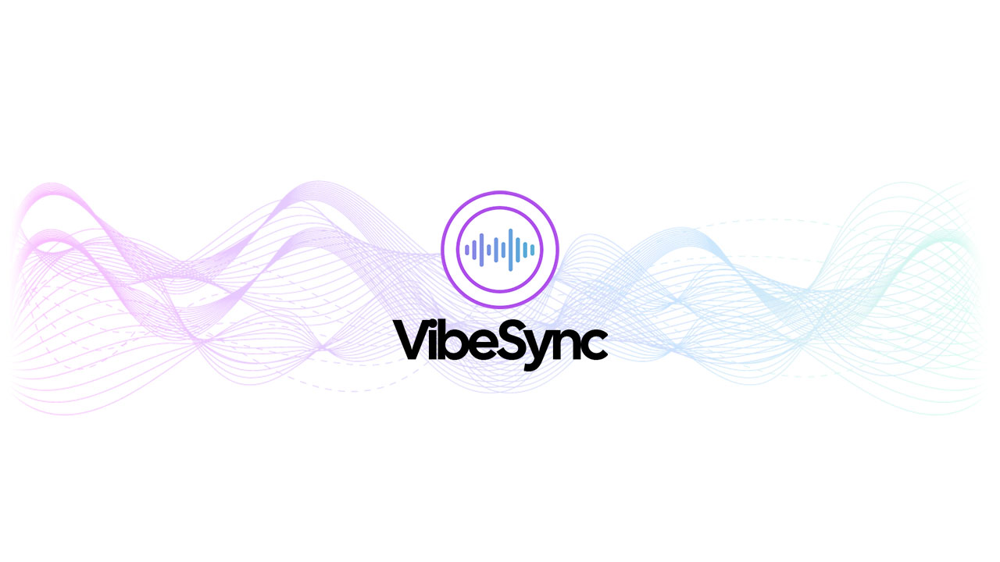

# vibesync

<!--배지-->
![MIT License][license-shield] ![Repository Size][repository-size-shield] ![Issue Closed][issue-closed-shield]

<!--프로젝트 대문 이미지-->

<!--프로젝트 버튼-->
 [![Readme in English][readme-eng-shield]][readme-eng-url]

 <!--목차-->
# 목차
- [[1] About the Project](#1-about-the-project)
  - [Technologies](#technologies)
- [[2] Project Team](#2-Project-Team)

 <!--목차 끝-->

# [1] About the Project
- 취향 기반 소셜 매칭 플랫폼 **VibeSync**
- **VibeSync**는 영화, 드라마, 음악, 애니메이션 등 다양한 콘텐츠에 대한 ***취향***을 중심으로 사람들을 연결하는 새로운 형태의 ***소셜 플랫폼***입니다.
- 콘텐츠 리뷰 및 감정 태깅, 실시간 스트리밍 경험 공유, 취향 기반 친구 매칭 등 기능을 통해 사용자에게 깊이 있는 소통과 연결 기회를 제공합니다.

## Technologies
- **Front-End**:   
- **Back-End**: 
- **Database**: 
- **IDE**:  
- **UI/UX**:  
- **Version Control**: 

<!--Url for Badges-->
[license-shield]: https://img.shields.io/github/license/dev-ujin/readme-template?labelColor=D8D8D8&color=04B4AE
[repository-size-shield]: https://img.shields.io/github/repo-size/dev-ujin/readme-template?labelColor=D8D8D8&color=BE81F7
[issue-closed-shield]: https://img.shields.io/github/issues-closed/dev-ujin/readme-template?labelColor=D8D8D8&color=FE9A2E

<!--Url for Buttons-->
[readme-eng-shield]: https://img.shields.io/badge/-readme%20in%20english-2E2E2E?style=for-the-badge

<!--URLS-->
[readme-eng-url]: README_EN.md
