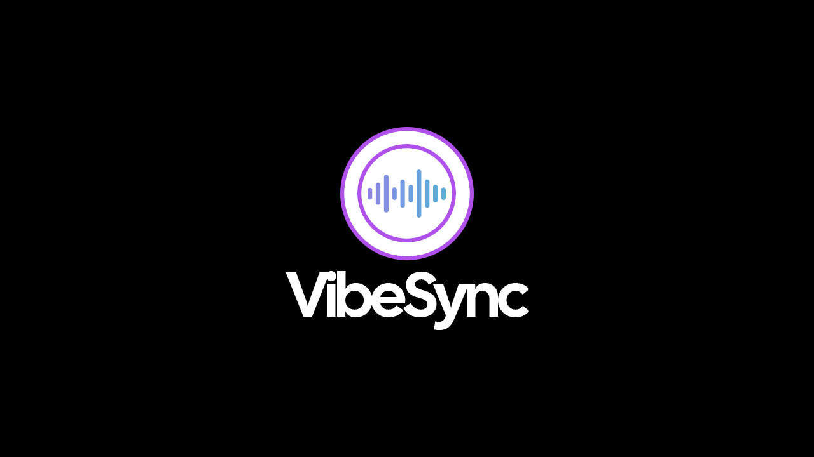

# VibeSync_작성: 김현수

<!--배지-->
![MIT License][license-shield] ![Repository Size][repository-size-shield] ![Issue Closed][issue-closed-shield]

<!--프로젝트 대문 이미지-->


<!--프로젝트 버튼-->
 [![Readme in English][readme-eng-shield]][readme-eng-url]

 <!--목차-->
# 목차
<details>
- <summary>🔽 [1 About the Project](#1-about-the-project)</summary>

- [Background & Problem Statement](#Background-&-Problem-Statement)  
- [Goals & Value Proposition](#Goals-&-Value-Proposition)  
- [Key Performance Indicators (KPI)](#Key-Performance-Indicators-(KPI))  
- [Technologies](#technologies)  

<details>
<summary>🔽 [Reference site](#Reference-site)</summary>

- [Reference Insights](#Reference-Insights)

</details>

</details>
- [[2] Project Team](#2-Project-Team)
- [[3] Logo CI](#3-Logo-CI)
- [[4] Usage](#4-usage)


 <!--목차 끝-->

# [1] About the Project
**“취향을 공유하고, 바이브를 연결하다”**

- 취향 기반 소셜 매칭 플랫폼 **VibeSync**
- **VibeSync**는 영화, 드라마, 음악, 애니메이션 등 다양한 콘텐츠에 대한 ***취향***을 중심으로 사람들을 연결하는 새로운 형태의 ***소셜 플랫폼***입니다.
- 콘텐츠 리뷰 및 감정 태깅, 실시간 스트리밍 경험 공유, 취향 기반 친구 매칭 등 기능을 통해 사용자에게 깊이 있는 소통과 연결 기회를 제공합니다.

## Background & Problem Statement

- SNS는 **양적 연결**(팔로워, 친구 수)에 집중되어 있어, 유사한 **취향** 기반의 깊이 있는 소통이 부족합니다.
- 사용자마다 선호하는 **미디어**(영화, 드라마, 음악, 애니 등)에 대한 **경험을 공유**할 공간이 제한적이며, 함께 실시간 시청할 플랫폼이 **분산**되어 있습니다.

## Goals & Value Proposition

1.	**취향 기반 매칭**: 사용자의 리뷰, 좋아요, 스크랩 포스트 등을 분석해 *공통 관심사*를 가진 사용자 간 **추천 및 매칭**을 제공합니다.
2.	**실시간 워치파티 기능**: 동기화된 *스트리밍 시청 경험*과 채팅·이모티콘 반응을 통해 물리적 거리를 넘어선 **라이브 커뮤니케이션**을 지원합니다.
3.	**개인 워크스페이스**: 일정 관리, 포스트(리스트) 컬렉션, 메모 기능으로 *개인화된 탐색 과정*을 체계적으로 관리할 수 있습니다. 워크스페이스는 **사용자별로 독립 운영**됩니다.
4.	**다목적 활용**: SNS 소셜 용도뿐만 아니라 *개인 업무 관리*, *기업 마케팅 캠페인* 등 다양한 목적에 맞춘 **유연한 플랫폼 활용**이 가능합니다.
5.	**다국어 지원 & 반응형 UI/UX**: 기본 영어 UI에 한국어를 추가 지원하고, PC·모바일 일관된 경험을 보장하는 **반응형 디자인**을 적용합니다.

## Key Performance Indicators (KPI)

-	주간 활성 사용자(WAU)
-	워치파티 참여 횟수 및 평균 시청 지속 시간

## Technologies

- **Front-End**:    
- **Back-End**: 
- **Database**: 
- **IDE**:  
- **UI/UX**:  
- **Version Control**: 

## Reference site

  <br>
| 서비스명 | 주요기능 | 강점 | 한계점 |
| --- | :--- | :--- | :--- |
| Notion | 개인 워크스페이스, 협업 문서 | 유연한 커스터마이징, 쉽게 조직화 | 미디어 리뷰·스트리밍 통합 기능 부족 |
| Instagram | 피드, 스토리, DM, 해시태그 기반 탐색 | 방대한 사용자풀, 쉬운 콘텐츠 공유 | 실시간 동시 시청, 취향 태깅 기능 부재 |
| Teleparty | 동기화 스트리밍, 채팅·이모티콘 반응 | 다양한 스트리밍 플랫폼 지원 | 별도 브라우저 확장 설치 필요, SNS 기능 미흡 |

## Reference Insights

-	**원스톱 플랫폼**으로서 리뷰·매칭·스트리밍·워크스페이스를 통합 제공
-	**플러그인 불필요:** 브라우저 기반으로 별도 설치 없이 즉시 사용 가능
-	감정 태그·분석을 통한 세분화된 **추천 경험** 필수
-	**채팅 기반 커뮤니티:** 실시간 텍스트·이모티콘 소통 기능 강화 필요

# [2] Project Team

||||||
|:-:|:-:|:-:|:-:|:-:|
|**김현수**<br/>[@jejuKIM99](https://github.com/jejuKIM99)<br>**Team Leader**<br>Planning/Management<br>UI/UX Design<br>FE/BE Development|**서재웅**<br/>[@ungs1026](https://github.com/ungs1026)<br>**Lead Developer**<br>Overall FE/BE Development|**박지웅**<br/>[@park-jiwoong](https://github.com/park-jiwoong)<br>**Team Member**|**김민선**<br/>[@msgggg1](https://github.com/msgggg1)<br>**Team Member**|**김예지**<br/>[@Yeji-Kim-Erica](https://github.com/Yeji-Kim-Erica)<br>**Team Member**|

# [3] Logo CI

- **Vibe**(감성, 파장)와 **Sync**(동기화)의 결합으로, 사용자 간의 감성과 경험을 연결한다는 의미를 담고 있습니다.
- 외각 원형: 글로벌 커뮤니티의 확장성과 끊김 없는 연결을 상징
- 중앙 사운드 웨이브 그래픽: 실시간 경험 공유, 감정의 파동(바이브)을 시각화
- 보라→파랑→초록 그라데이션: 다양한 취향과 감정 스펙트럼을 표현

# [4] Usage
*★는 해당 작업 주 작업자*<br>
*전체 공동 개발로 구분 불가일 경우 총괄만 ★로 표시*<br><br>

<h2>Index Page_제작: ★김현수,서재웅</h2>


 
- **Index Page**의 최초 로드 모습입니다. 해당 페이지는 페이지 초기 로드시 나타나며, 간단한 애니메이션을 포함하고 있습니다.<br><br>


- 우측 하단 언어 번경 기능을 통해 페이지 내 언어를 변경할 수 있습니다. 변경 가능 언어는 영어/한국어 입니다.
- 번역은 데이터를 js로 작성하고 선택에 맞게 내용을 변경하는 형태 입니다.<br><br>

***\<예시\>***
```html

  <section id="section2">
    <div class="content">
      <p class="Purpose_p" data-key="about.title">About VibeSync</p>
    .
    .
    .
    </div>
  </section>
  .
  .
  .
  <!-- 언어 선택 드롭다운 -->
  <select id="language-select">
    <option value="en">English</option>
    <option value="ko">한국어</option>
  </select>

```


```javascript

    // 번역 데이터
    const translations = {
      en: {
        "data-key_name": "contents",
        "data-key_name": "contents",
        .
        .
        .
   },
      ko: {
        "data-key_name": "contents",
        "data-key_name": "contents",
        .
        .
        .
   }
}

```
<br><br>
<h2>Login Page_제작: ★김민선, 김현수</h2>


- **Login Page**입니다. **Index Page**의 nav 우측 Get Start버튼을 눌러 진입합니다.
- 반응형으로 디자인 되었으며, 한 페이지에서 폼 양식 전환으로 로그인/회원가입을 처리합니다.
- 비밀번호 패턴이 정의하여 사용자에게 패턴에 맞는 입력을 유도합니다.<br><br>

<예시>
```html

<label for="userPw" class="sr-only">비밀번호</label> <input type="password" id="userPw" name="userPw" placeholder="Password" required pattern="^(?=.*[A-Za-z])(?=.*\d)(?=.*[!@#$%^&*])[A-Za-z\d!@#$%^&*]{8,}$" title="8자 이상, 영문자, 숫자, 특수문자를 모두 포함해야 합니다.">

```
```javascript

    // 회원가입 폼 보여주기
    function showSignupForm() {
        // .length를 확인하여 요소 존재 여부 체크
        if ($loginFormContainer.length && $signupFormContainer.length && $switchFormLinkContainer.length) {
            $loginFormContainer.hide(); // 로그인 폼 숨기기
            $signupFormContainer.css('display', 'flex'); // 회원가입 폼 보이기 
            $switchFormLinkContainer.hide(); // '아직 회원이 아니신가요?' 링크 숨기기
        }
    }

    // 로그인 폼 보여주기
    function showLoginForm() {
        if ($loginFormContainer.length && $signupFormContainer.length && $switchFormLinkContainer.length) {
            $loginFormContainer.css('display', 'flex'); // 로그인 폼 보이기 
            $signupFormContainer.hide(); // 회원가입 폼 숨기기
            $switchFormLinkContainer.show(); // '아직 회원이 아니신가요?' 링크 보이기 (기본 display block)
        }
    }

    // '회원가입' 링크 클릭 이벤트 (.on() 사용)
    if ($switchToSignupLink.length) {
        $switchToSignupLink.on('click', function(event) {
            event.preventDefault(); // 링크 기본 동작 중단
            showSignupForm();
        });
    }

    // '로그인' 링크(회원가입 폼 내부) 클릭 이벤트
    if ($switchToLoginLink.length) {
        $switchToLoginLink.on('click', function(event) {
            event.preventDefault();
            showLoginForm();
        });
    }

```
<br><br>
<!--Url for Badges-->
[license-shield]: https://img.shields.io/github/license/dev-ujin/readme-template?labelColor=D8D8D8&color=04B4AE
[repository-size-shield]: https://img.shields.io/github/repo-size/dev-ujin/readme-template?labelColor=D8D8D8&color=BE81F7
[issue-closed-shield]: https://img.shields.io/github/issues-closed/dev-ujin/readme-template?labelColor=D8D8D8&color=FE9A2E

<!--Url for Buttons-->
[readme-eng-shield]: https://img.shields.io/badge/-readme%20in%20english-2E2E2E?style=for-the-badge

<!--URLS-->
[readme-eng-url]: README_EN.md
